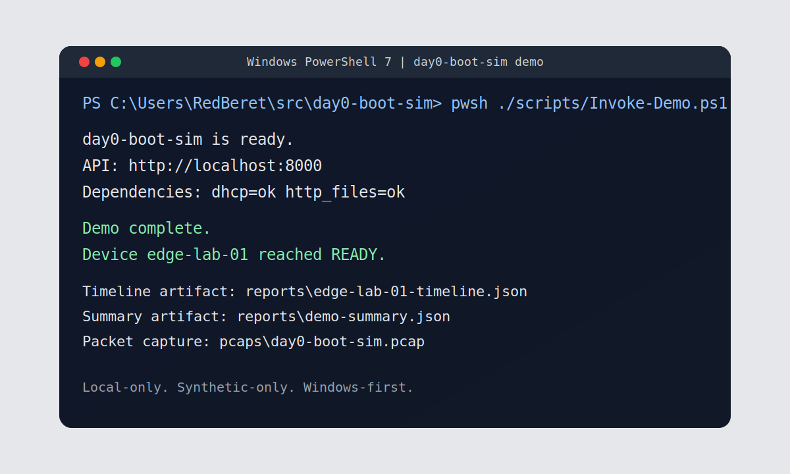
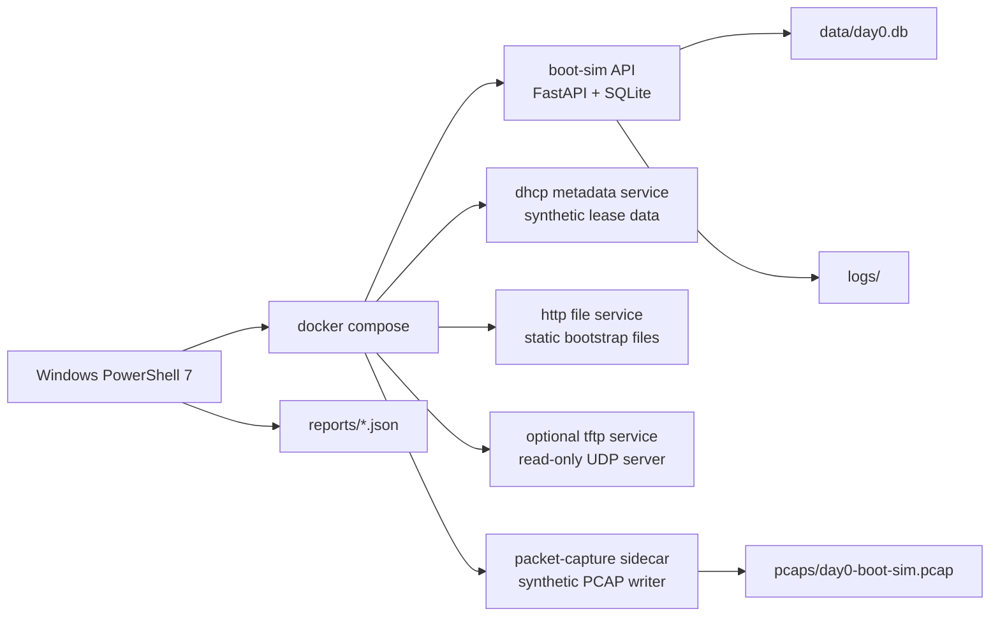

# day0-boot-sim


Built by RedBeret as a local-first training lab for Day 0 provisioning workflows on Windows.

I wanted a safe way to teach Day 0 bootstrapping from a Windows laptop without reaching for real hardware, real credentials, or real customer data. This repo is that lab.

`day0-boot-sim` is a Windows-first, local-only simulator that models the Day 0 flow end to end:

- synthetic DHCP metadata
- bootstrap file fetch over HTTP
- optional TFTP service
- state transitions and timeline events
- structured logs, retries, timeouts, and health checks
- SQLite-backed device state
- a deterministic PCAP artifact for packet-study drills

The main path is one command from Windows PowerShell:

```powershell
pwsh ./scripts/Invoke-Demo.ps1
```

After the images are built, the default demo path normally finishes in well under 5 minutes.



## Why This Repo Exists

Most Day 0 examples either assume Linux-only tooling, real vendor gear, or a lot of hidden context. I wanted something simpler:

- safe enough to publish and share
- realistic enough to teach the mental model
- small enough to run on a laptop
- opinionated enough to be useful on the first run

## Quickstart

### Prerequisites

- Windows host
- PowerShell 7
- Docker Desktop with the WSL2 backend enabled

### Run the demo

```powershell
pwsh ./scripts/Invoke-Demo.ps1
```

### Stop the lab

```powershell
pwsh ./scripts/Stop-Lab.ps1
```

### Artifacts to inspect

- `reports/demo-summary.json`
- `reports/edge-lab-01-timeline.json`
- `reports/devices.json`
- `reports/health.json`
- `pcaps/day0-boot-sim.pcap`
- `logs/*.jsonl`

### Expected terminal output

```text
day0-boot-sim is ready.
API: http://localhost:8000
Dependencies: dhcp=ok http_files=ok
Demo complete.
Device edge-lab-01 reached READY.
Timeline artifact: reports\edge-lab-01-timeline.json
Summary artifact: reports\demo-summary.json
Packet capture: pcaps\day0-boot-sim.pcap
```

## Demo Flow



## What this teaches

- How a Day 0 flow moves from `INIT` to `READY`.
- How DHCP-style metadata points a device at the next bootstrap artifact.
- How bootstrap files, state machines, and persistence fit together.
- How retries, timeouts, idempotency, validation, and health checks affect operator experience.
- How to compare structured logs, timelines, and packet captures during troubleshooting.

## What this is not

- It is not a real DHCP appliance.
- It is not a real packet sniffer.
- It is not a vendor implementation.
- It is not a substitute for hardware labs or production provisioning pipelines.
- It does not use customer data, real credentials, real serial numbers, or proprietary images.
- It does not touch physical interfaces on the Windows host.

## Guardrails

- Host workflow starts in Windows PowerShell 7.
- Linux-only tooling runs in Docker containers or WSL2 Ubuntu.
- Hostnames are synthetic `*.day0.example`.
- IP examples use RFC 5737 documentation ranges such as `192.0.2.0/24`, `198.51.100.0/24`, and `203.0.113.0/24`.
- Usernames, passwords, serials, and config fragments are fake.

## API Surface

- `GET /health`
- `GET /devices`
- `POST /devices/{id}/boot`
- `GET /devices/{id}/timeline`

Example manual boot request:

```powershell
$body = @{
  operator = "bootstrap-operator"
  scenario = "success"
  force_reboot = $false
} | ConvertTo-Json

Invoke-RestMethod -Method Post -Uri http://localhost:8000/devices/edge-lab-01/boot -ContentType application/json -Body $body
```

## Supported Scenarios

- `success`
- `missing-bootstrap`
- `timeout-once`
- `bad-metadata`

## Repository Tour

- `scripts/` contains the Windows entrypoints.
- `src/day0_boot_sim/` contains the simulator, API, storage layer, and sidecar services.
- `bootfiles/` contains synthetic bootstrap and config artifacts served over HTTP and optional TFTP.
- `docs/` contains the runbook, study material, failure guides, and ADRs.
- `tests/` contains the required pytest coverage.
- `Makefile` is the WSL-friendly task runner for Linux-side workflows.

## WSL Workflow

If you want Linux-side commands inside WSL2 Ubuntu:

```bash
make install
make test
make up
make down
```

The Windows host is still the primary entrypoint. The `Makefile` is there for WSL and container-friendly workflows, not as the main user path.

## Why the stack looks like this

- The DHCP component is synthetic because the learning goal is metadata flow, not raw socket behavior on Windows.
- The PCAP is generated by a sidecar because I wanted a deterministic training artifact without privileged host sniffing.
- SQLite keeps the repo portable and makes state easy to inspect or reset.
- PowerShell wrappers make the public demo path obvious for Windows users.

## Further Reading

- [Engineering Notes](docs/engineering-notes.md)
- [Study Guide](docs/study-guide.md)
- [Runbook](docs/runbook.md)
- [Failure Modes](docs/failure-modes.md)
- [Review Questions](docs/review-questions.md)
- [ADRs](docs/adr)

## Contributing

If you want to extend the simulator, start with [CONTRIBUTING.md](CONTRIBUTING.md). The short version is simple: keep it synthetic, keep it safe, and keep the Windows-first workflow intact.

## Project Standards

- [MIT License](LICENSE)
- [Code of Conduct](CODE_OF_CONDUCT.md)
- [Security Policy](SECURITY.md)
# day0-boot-sim
