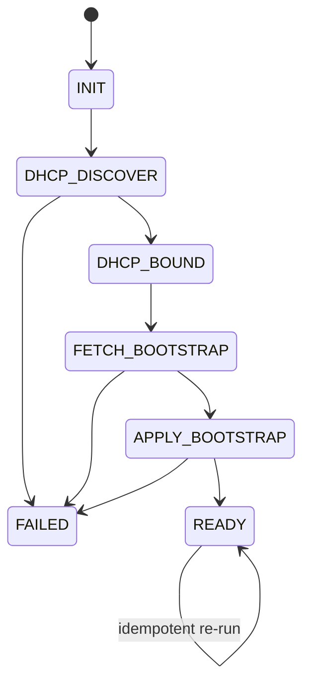

# Engineering Notes

## Purpose

This repo teaches the Day 0 provisioning mental model before full configuration management. The implementation is intentionally synthetic so it can run safely on a Windows workstation with Docker Desktop and WSL2.

## State Machine

## Service Breakdown

- `boot-sim`: FastAPI app that owns the state machine, SQLite persistence, timeline events, and health reporting.
- `dhcp`: synthetic DHCP metadata service. It models the data that a device would learn from DHCP rather than binding raw sockets on the host.
- `http-files`: static file service for bootstrap documents and config fragments.
- `tftp`: optional read-only TFTP server for training comparisons.
- `packet-capture`: sidecar that turns timeline events into a deterministic synthetic PCAP for Wireshark study.

## Why the DHCP Service Is Synthetic

Running a real DHCP server from Docker Desktop on Windows is awkward and unnecessary for the learning goal. The repo models the lease payload instead:

- boot file URI
- optional config server URI
- fake serial
- fake model
- synthetic management IP
- synthetic DHCP server IP

That keeps the mental model intact while avoiding host networking surprises.

## Data Model

SQLite stores two main records:

- `devices`: current state, last error, readiness, metadata, and bootstrap checksum.
- `timeline`: append-only event history for tracing and review.

This split keeps reads simple:

- `GET /devices` shows the current view.
- `GET /devices/{id}/timeline` shows the event-by-event story.

## Reliability Patterns

The simulator intentionally includes production-flavored guardrails:

- Structured JSON logging to `logs/*.jsonl`
- Pydantic validation for requests, DHCP metadata, and bootstrap files
- Retries with exponential backoff for retryable upstream failures
- Explicit HTTP timeouts
- Idempotent `READY` re-runs for the same scenario
- Health checks in both the API and Docker Compose

## Synthetic Naming and Addressing

- Hostnames use `*.day0.example`
- HTTP files use `files.day0.example`
- DHCP metadata uses `dhcp.day0.example`
- Optional TFTP uses `tftp.day0.example`
- Example IP ranges use:
  - `192.0.2.0/24`
  - `198.51.100.0/24`
  - `203.0.113.0/24`

## Event and Packet Trace Design

The packet sidecar does not sniff the host. It observes boot events and writes a deterministic training PCAP:

- DHCP discover and acknowledge
- HTTP bootstrap fetch
- bootstrap apply marker
- ready response marker

This is deliberate. The goal is to teach packet-reading patterns without requiring privileged capture on the Windows host.

## Design Limits

- No real vendor protocol quirks
- No physical NIC integration
- No control-plane authentication workflows
- No customer data or device-specific syntax beyond fake training artifacts
